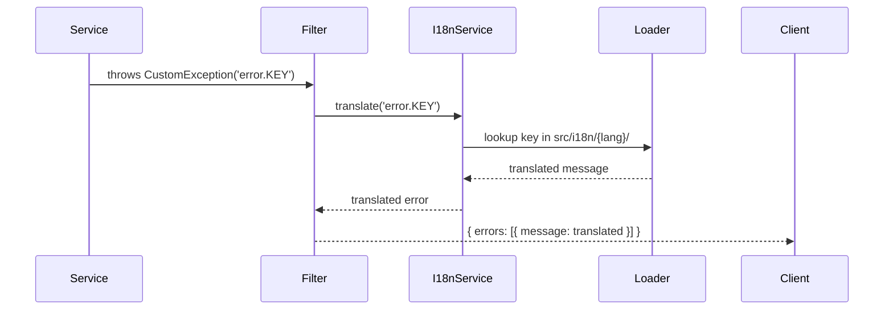

# StayHub — Airbnb Clone API

<p align="center">
  
  
  
  
</p>

A production-style backend for an Airbnb-inspired booking platform, built with **NestJS**, **MongoDB**, **JWT**, and **Clean Architecture** principles.

This is not a small CRUD demo — it's a real API with authentication, role-based authorization, file uploads, bookings, reviews, OTP flows, internationalized error handling, and local infrastructure via Docker.

---

## ✨ Features

### Authentication & Authorization
- Register, login, and refresh token flows
- JWT access tokens with short-lived expiry
- HttpOnly refresh token cookies with secure rotation
- Role-based access control (users & system admins)
- Guards and decorators for protected routes

### User Management
- Secure password hashing with Argon2id
- Profile management with DTO validation
- Phone number validation (Egyptian numbers)

### Units / Listings
- Create, update, delete, activate/deactivate listings
- Owner-level authorization checks
- Unit photo upload with validation
- S3-compatible storage (MinIO for local dev)

### Bookings
- Availability checks before booking
- Price calculation
- Guest booking update and cancellation flows
- Host booking status management
- Booking review submission

### Reviews & Ratings
- Submit reviews after booking
- Unit review aggregation and listing

### Favorites
- Save and manage favorite units

### OTP & Email
- OTP generation, storage, sending, and verification (`/otp`)
- Registration is gated behind a verified OTP
- Mail adapter pattern with Nodemailer support
- Reusable, StayHub-branded HTML email templates (OTP, welcome, password reset, email verification, booking confirmation/cancellation/reminder)
- Mailpit for local email testing

### Infrastructure
- MongoDB with Mongoose
- Docker Compose for MongoDB, MinIO, and Mailpit
- File upload validation by size, extension, and file signature
- AWS SDK S3-compatible storage

### Developer Experience
- Global exception handling with translated messages (`nestjs-i18n`)
- DTO validation and response transformation (`class-validator`, `class-transformer`)
- Swagger / OpenAPI documentation
- Reusable base repository pattern
- Use-case based application structure
- Joi config validation
- ESLint for code quality

---

## 🏗️ Architecture

The project follows a **use-case based** clean architecture:

```
src/
├── modules/
│   ├── auth/               → Authentication, JWT, refresh tokens, guards
│   ├── users/              → User management, profiles
│   ├── units/              → Rental unit listing lifecycle
│   ├── bookings/           → Availability, booking requests, reviews
│   ├── unit-favorites/     → Favorite units
│   ├── files-upload/       → Storage abstraction and upload use cases
│   ├── mail/               → Email adapter abstraction + templates
│   ├── otp/                → OTP generation, storage, sending, verification
│   ├── system-admins/      → Admin bootstrap and management
│   ├── countries/          → Country reference data
│   ├── cities/             → City reference data
│   ├── currencies/         → Currency reference data
│   ├── unit-categories/    → Unit category reference data
│   └── app-settings/       → Application settings
├── common/
│   ├── error-handling/     → Custom exceptions, filters, DTOs
│   ├── configuration/      → Config module, validation, environment
│   ├── guards/             → Reusable guards
│   ├── interceptors/       → Response interceptors
│   ├── decorators/         → Custom decorators
│   └── utils/              → Shared utilities
├── i18n/                   → Translation resources (ar/en)
│   ├── en/
│   │   ├── auth.json
│   │   ├── user.json
│   │   ├── error.json
│   │   ├── validation.json
│   │   ├── otp.json
│   │   └── mail.json
│   └── ar/
│       ├── auth.json
│       ├── user.json
│       ├── error.json
│       ├── validation.json
│       ├── otp.json
│       └── mail.json
├── core.module.ts          → Core module (I18n, Mongoose, Config)
├── app.module.ts           → Root application module
└── main.ts                 → Application bootstrap
```

### Key Patterns

| Pattern | Location | Purpose |
|---------|----------|---------|
| **Controller** | `modules/*/controllers/` | Receives HTTP requests, delegates to services |
| **Service** | `modules/*/services/` | Coordinates use cases |
| **UseCase** | `modules/*/use-cases/` | Contains focused business actions |
| **DTO** | `modules/*/dto/` | Validates input and shapes responses |
| **Schema** | `modules/*/schemas/` | Defines MongoDB documents with Mongoose |
| **Swagger** | `modules/*/swagger/` | Documents endpoints with `applyDecorators` |
| **Repository** | `common/` | Reusable base repository for MongoDB |

## 🔄 NestJS Lifecycle Hooks

### onModuleInit()
يُستدعى بعد أن يقوم NestJS بحل جميع تبعيات الوحدة (Module) الحالية. يُستخدم لتهيئة موارد تعتمد على توفر الخدمات الأخرى داخل نفس الوحدة.

### onApplicationBootstrap()
يُستدعى بعد أن تنتهي جميع الوحدات من التهيئة، وقبل أن يبدأ الخادم في استقبال الطلبات. مناسب لتنفيذ مهام تهيئة شاملة تحتاج إلى تطبيق كامل الجاهزية.

### onModuleDestroy()
يُستدعى عند تلقي إشارة إيقاف (مثل SIGTERM) قبل تحرير الموارد. يستخدم لإغلاق الاتصالات أو تنظيف البيانات بشكل آمن داخل الوحدة.

### beforeApplicationShutdown()
يُستدعى بعد تنفيذ `onModuleDestroy()` لجميع الوحدات، وقبل إغلاق الخادم بالكامل. مناسب لإجراء تنظيف عام قبل إغلاق التطبيق.

### onApplicationShutdown()
يُستدعى بعد إغلاق جميع الاتصالات (أي بعد `app.close()`). يُستخدم لتنفيذ مهام نهائية مثل تسجيل الخروج من الأنظمة الخارجية أو إطلاق مؤشرات الأداء.

> **ملاحظة**: لتفعيل خطافات الإنهاء (الثلاثة الأخيرة)، يجب استدعاء `app.enableShutdownHooks()` عند بدء التطبيق.

---

## 🧰 Tech Stack

| Layer | Technology |
|-------|-----------|
| Framework | NestJS 11 |
| Language | TypeScript |
| Database | MongoDB with Mongoose |
| Validation | class-validator, class-transformer, Joi |
| i18n | nestjs-i18n |
| File Storage | S3-compatible (MinIO for local dev) |
| Email | Nodemailer with adapter pattern |
| Email Testing | Mailpit |
| API Docs | Swagger / OpenAPI |
| API Testing | Bruno (`air-bnb-collection`) |
| Package Manager | pnpm |
| Node Version Manager | fnm |
| Containerization | Docker Compose |
| Linting | ESLint |
| Testing | Jest |

---

## ✅ Prerequisites

- [Node.js](https://nodejs.org/) — managed via [fnm](https://github.com/Schniz/fnm)
- [pnpm](https://pnpm.io/)
- [Docker](https://www.docker.com/) & Docker Compose

---

## 🚀 Getting Started

### 1. Clone the repository

```bash
git clone <repo-url>
cd stayhub_airbnb
```

### 2. Install dependencies

```bash
pnpm install
```

### 3. Set up environment variables

```bash
cp .env.example .env.development
```

### 4. Start local infrastructure

```bash
docker compose up -d
```

### 5. Run the app

```bash
pnpm run start:dev
```

---

## 🌐 API Endpoints

### Authentication

| Method | Endpoint | Description |
|--------|----------|-------------|
| POST | `/auth/register` | Register a new user |
| POST | `/auth/login` | Login and get tokens |
| POST | `/auth/refresh` | Refresh access token |
| POST | `/auth/logout` | Logout (invalidate refresh token) |

### Users

| Method | Endpoint | Description |
|--------|----------|-------------|
| POST | `/users` | Create a new user |

### System Admins

| Method | Endpoint | Description |
|--------|----------|-------------|
| POST | `/system-admins/login` | System admin login |

### OTP

| Method | Endpoint | Description |
|--------|----------|-------------|
| POST | `/otp/send` | Send an OTP to the given email |
| POST | `/otp/verify` | Verify an OTP code |

### Mail

| Method | Endpoint | Description |
|--------|----------|-------------|
| POST | `/mail/send` | Send a raw email (text/HTML) |
| POST | `/mail/send-template` | Render and send a StayHub email template |

### Swagger Documentation

```
http://localhost:3001/api/docs
```

---

## 🐳 Docker Services

| Service | Port | URL |
|---------|------|-----|
| MongoDB | 27018 | `mongodb://localhost:27018/airbnbDB?replicaSet=rs0` |
| MinIO API | 9000 | `http://localhost:9000` |
| MinIO Console | 9001 | `http://localhost:9001` |
| Mailpit SMTP | 1025 | `localhost:1025` |
| Mailpit UI | 8025 | `http://localhost:8025` |

Initialize MongoDB replica set:

```bash
pnpm run docker:rs:init:local
```

---

## ⚙️ Configuration

### Environment Variables

```env
PORT=3001
NODE_ENV=development
MONGO_URI=mongodb://localhost:27018/airbnbDB?replicaSet=rs0
JWT_SECRET=themostsecretkey

SYSTEM_ADMIN_EMAIL=admin@airbnb.com
SYSTEM_ADMIN_PASSWORD=pass123

AWS_S3_REGION=eu-central-1
AWS_S3_ACCESS_KEY_ID=minioadmin
AWS_S3_SECRET_ACCESS_KEY=minioadmin
AWS_S3_BUCKET_NAME=airbnb-api-clone
MINIO_S3_ENDPOINT=http://localhost:9000

SMTP_HOST=localhost
SMTP_PORT=1025
SMTP_SECURE=false
SMTP_SERVICE=
SMTP_FROM="StayHub" <no-reply@stayhub.com>
SMTP_AUTH_EMAIL=
SMTP_AUTH_PASS=
```

### TypeScript Config

If you hit a `baseUrl is deprecated` warning on newer TypeScript versions, add the following inside `compilerOptions` in `tsconfig.json`:

```jsonc
"ignoreDeprecations": "6.0"
```

---

## 🌍 Internationalization (i18n)

Error and validation messages are translated via `nestjs-i18n`. Translation resources live under `src/i18n/<lang>/`.

### Supported Languages
- Arabic (`ar`)
- English (`en`)

### Translation Files

```
src/i18n/
├── en/
│   ├── auth.json      → Auth DTO validation messages
│   ├── user.json      → User DTO validation messages
│   ├── error.json     → Business error messages
│   ├── validation.json → Generic validation messages
│   ├── otp.json       → OTP error messages
│   └── mail.json      → Mail error messages
└── ar/
    ├── auth.json
    ├── user.json
    ├── error.json
    ├── validation.json
    ├── otp.json
    └── mail.json
```

### i18n Flow



### Language Resolution

1. **Query Parameter**: `?lang=en`
2. **Header**: `x-lang: ar`
3. **Accept-Language**: Browser header

---

## 🛡️ Error Handling

All exceptions are caught by a global `CustomExceptionFilter` and normalized into a consistent response shape:

```json
{
  "errors": [
    {
      "field": "email",
      "message": "Email is required."
    }
  ]
}
```

### Error Flow

1. **Service** throws exception with i18n key as message
   ```typescript
   throw new CustomConflictException('error.EMAIL_ALREADY_REGISTERED');
   ```

2. **CustomExceptionFilter** catches it and calls `exception.formatError(i18nService)`

3. **BaseCustomException.formatError()** calls `i18nService.translate(this.message)`

4. **CustomI18nService.translate()** gets current language from `I18nContext.current()?.lang`

5. **I18nJsonLoader** looks up key in `src/i18n/{lang}/error.json`

6. Translated message is returned based on the current language

### Custom Exceptions

| Exception | HTTP Status | Usage |
|-----------|-------------|-------|
| `CustomBadRequestException` | 400 | Bad request errors |
| `CustomUnauthorizedException` | 401 | Authentication errors |
| `CustomForbiddenException` | 403 | Authorization errors |
| `CustomNotFoundException` | 404 | Resource not found |
| `CustomConflictException` | 409 | Conflict errors (duplicates) |
| `CustomUnprocessableEntityException` | 422 | Validation errors |

---

## 🧪 Testing

```bash
pnpm run test          # Unit tests
pnpm run test:e2e      # End-to-end tests
pnpm run test:cov      # Coverage report
```

---

## 📮 API Testing

A ready-to-use [Bruno](https://www.usebruno.com/) collection is available under `air-bnb-collection/` for testing all API flows locally.

Available collections:
- Auth
- System admin login
- Countries, cities, currencies, and unit categories
- App settings
- Units
- Unit photos
- Bookings
- Favorites
- OTP
- Mail

---

## 📖 Module Guides

Deeper documentation lives in each module's `md/` folder:

- **Mail Service Integration** — `src/modules/mail/md/MAIL_SERVICE_INTEGRATION.md`
  Adapter pattern, Nodemailer transporter, SMTP/Mailpit setup, and the `EMAIL_ADAPTER` injection token.
- **Use Case Architecture Pattern** — `src/modules/auth/md/use-case-arch-pattern-guide.md`
  How controllers delegate to services, which delegate to focused use cases and repositories.
- **Refresh Token Guide** — `src/modules/auth/md/refresh-token-guide.md`
  Why refresh tokens are used, DB-stored vs stateless approaches, and lifecycle diagrams.
- **System Admin Login Flow** — `src/modules/system-admins/md/system-admin-login-flow.md`
  Sequence diagram and process for system-admin authentication.

---

## 💡 Highlights

Many backend tutorials stop at simple CRUD. This project goes further by connecting real features end to end:

- Authentication is connected to role guards and current-user decorators
- Units are connected to owners, files, categories, currencies, bookings, reviews, and favorites
- Bookings are connected to availability validation, business rules, host actions, guest actions, and reviews
- Email and OTP are wired for real account flows such as forgot password
- Infrastructure is not ignored: MongoDB, object storage, and email testing run locally with Docker

The focus is not only on NestJS syntax, but on how to think, structure, debug, and extend a backend project.

---

## 📄 License

This project is licensed under the MIT License.
