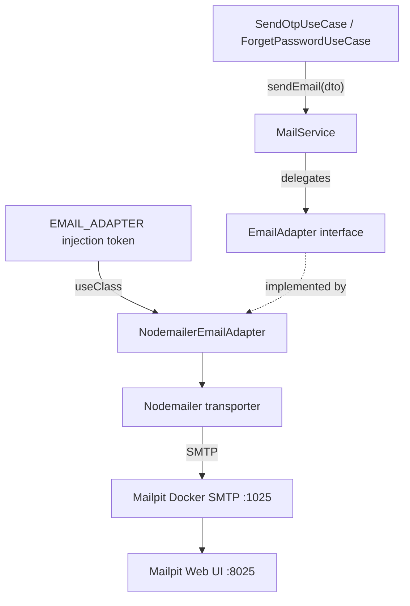

# Send Email Module Explanation

## Goal

The mail module provides one reusable service method, `MailService.sendEmail()`, that sends plain text emails. OTP and forget-password flows use this service to send verification codes.

The module follows the adapter design pattern:

- `MailService` is the stable application-facing service.
- `EmailAdapter` is the contract for sending email.
- `NodemailerEmailAdapter` is the current concrete implementation.
- `EMAIL_ADAPTER` is the NestJS dependency injection token that connects the contract to the implementation.

This means the app can later switch from Nodemailer/Mailpit to another provider, such as SendGrid or AWS SES, without changing the OTP or forget-password use cases.

## 1. Docker Mailpit Image

For local development, we use Mailpit as a fake SMTP server. It receives emails from the backend and shows them in a browser UI instead of sending real emails.

```yaml
mailpit:
  image: axllent/mailpit:latest
  container_name: mailpit
  ports:
    - 1025:1025
    - 8025:8025
```

### Ports

- `1025`: SMTP port used by Nodemailer.
- `8025`: Web UI where you can read received emails.

### Run Mailpit

```bash
docker compose up -d mailpit
```

### Open Mailpit UI

```text
http://localhost:8025
```

## 2. Environment Variables

In local development, the backend sends emails to Mailpit using these values:

```env
SMTP_HOST=localhost
SMTP_PORT=1025
SMTP_SECURE=false
```

If the Nest app runs inside Docker, use the Docker service name instead:

```env
SMTP_HOST=mailpit
SMTP_PORT=1025
SMTP_SECURE=false
```

For production or staging, SMTP auth can still be used:

```env
SMTP_SERVICE=gmail
SMTP_AUTH_EMAIL=your-email@gmail.com
SMTP_AUTH_PASS=your-app-password
SMTP_SECURE=true
```

## 3. Adapter Design Pattern

The mail module hides the email provider behind an adapter interface. The business flow asks `MailService` to send an email. `MailService` delegates to `EmailAdapter`. NestJS resolves `EmailAdapter` through the `EMAIL_ADAPTER` token and uses `NodemailerEmailAdapter`.



### Why Use `EMAIL_ADAPTER`?

`EmailAdapter` is a TypeScript interface. Interfaces do not exist at runtime, so NestJS cannot inject them directly.

This token gives NestJS a real runtime key:

```typescript
export const EMAIL_ADAPTER = Symbol('EMAIL_ADAPTER');
```

Then `MailModule` maps that key to the concrete adapter:

```typescript
{
  provide: EMAIL_ADAPTER,
  useClass: NodemailerEmailAdapter,
}
```