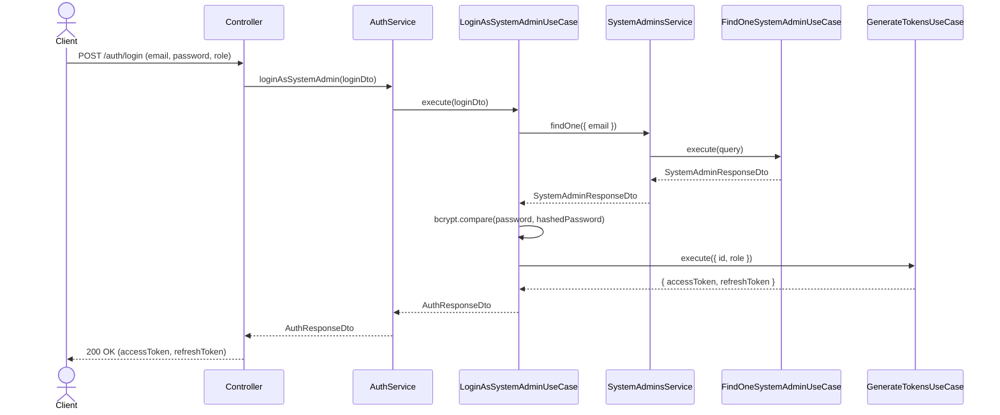

# System Admin Login Flow

## Sequence Diagram

## Login Process

1. Admin provides email and password
2. System validates credentials
3. System returns JWT token
4. Admin uses token for subsequent requests

## Super Admin

- First admin created is automatically a super admin
- Super admin can manage other admins
- Super admin has full system access
